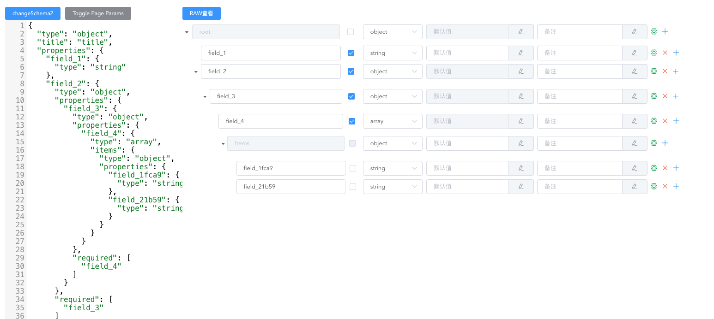

# vue-json-schema-editor-visual

[](https://www.npmjs.com/package/vue-json-schema-editor-visual)

A json-schema editor of high efficient and easy-to-use, base on Vue & Element UI.

一个高效易用的基于 Vue + Element UI 的 json-schema 编辑器。 模仿 Yapi React 版本 [json-schema-editor-visual](https://github.com/YMFE/json-schema-editor-visual) 实现



## Usage

```js
import JsonSchemaEditor from 'vue-json-schema-editor-visual';

Vue.use(JsonSchemaEditor);
```

在线 Demo

- [Sinokit json-schema-editor](http://blog.giscafer.com/sinokit/#/./components/jsonschema-editor)
- [CodeSandbox Demo](https://codesandbox.io/s/practical-pond-jpteu?file=/src/App.vue)

## API

### Attributes

|         参数         | 说明                                  |   类型    | 默认值  |
| :------------------: | ------------------------------------- | :-------: | :-----: |
|       `schema`       | json schema 对象                      | `Object`  |    -    |
|      `show-raw`      | 是否显示 RAW 弹窗，可查看 json schema | `Boolean` | `false` |
|      `is-mock`       | 是否支持 mock （WIP）                 | `Boolean` | `false` |
| `show-default-value` | 是否展示默认值输入框                  | `Boolean` | `false` |

### Events

|    事件名称     | 说明                        |       回调参数        |
| :-------------: | --------------------------- | :-------------------: |
| `schema-change` | schema 发生变化时的回调函数 | 新的 json schema 对象 |

## Related

- [json-schema-editor-vue](https://github.com/zyqwst/json-schema-editor-vue) vue + ant-design-vue

其他 json editor

- [jsoneditor](https://github.com/josdejong/jsoneditor)
- [json-editor/json-editor](https://github.com/json-editor/json-editor)
- [jinkin1995/vue-json-edit](https://github.com/jinkin1995/vue-json-edit)

## License

MIT
